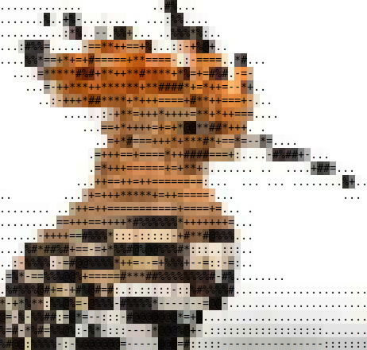

# hoopoe-player

> Play any video as colorful ASCII art directly in your terminal.


[](https://github.com/axol8002/hoopoe-player/issues)

## Installation

```bash
# Most systems
pip install hoopoe-player

# Ubuntu/Debian
pipx install hoopoe-player
```

You also need `ffmpeg` for audio:
```bash
sudo apt install ffmpeg   # Ubuntu/Debian
sudo pacman -S ffmpeg     # Arch
```

## Usage

```bash
# Play a YouTube video
hoopoe https://www.youtube.com/watch?v=xxxxx

# Play a local file
hoopoe -l video.mp4

# Enable audio
hoopoe -s https://www.youtube.com/watch?v=xxxxx

# Change character mode
hoopoe -m blocks https://www.youtube.com/watch?v=xxxxx

# Show status bar (time, volume, controls)
hoopoe --hud https://www.youtube.com/watch?v=xxxxx

# Loop video automatically
hoopoe --loop https://www.youtube.com/watch?v=xxxxx

# Sync video frames to audio clock (experimental)
hoopoe -s --sync https://www.youtube.com/watch?v=xxxxx

# Combine options
hoopoe -l -s -m invert --hud --loop video.mp4
```

## Features

- 🎬 **YouTube & local video** — stream any YouTube URL or play a local file directly
- 🎨 **6 character modes** — classic, blocks, braille, minimal, invert, nocolor
- 🌈 **True color** — full 24-bit RGB color per character for supported terminals
- 🔊 **Audio playback** (`-s`) — synced audio via ffmpeg/ffplay
- 📺 **Live stream support** — plays YouTube live streams with low-latency audio mode
- 🔗 **A/V sync mode** (`--sync`) ⚠️ *experimental* — drops frames to stay locked to the audio clock when rendering is slow
- 🖥️ **HUD** (`--hud`) — status bar with timestamp, real-time FPS, volume, mode and controls
- 🔁 **Loop mode** (`--loop`) — automatically restarts video and audio at the end
- 📸 **Screenshot** (`P`) — saves the current frame as a timestamped ANSI color file (`.ans`)
- ↔️ **Seek & volume** — keyboard controls for seeking and volume adjustment
- 📐 **Dynamic resize** — terminal resize is applied immediately, even while paused

> ⚠️ **Known issues:** audio does not play on live streams yet. Video renders correctly but the audio stream fails to start. Tracked in [#1](https://github.com/axol8002/hoopoe-player/issues/1). Audio/video sync after pause/resume ([#2](https://github.com/axol8002/hoopoe-player/issues/2)) is partially fixed but may still drift on long videos or slow network streams.

## Controls

| Key | Action |
|-----|--------|
| `Space` | Pause / Play |
| `←` / `→` | Seek −10s / +10s |
| `↑` / `↓` | Volume +10 / −10 (only with `-s`) |
| `P` | Screenshot — save current frame as `.ans` ANSI file |
| `Q` or `Ctrl+C` | Quit |

## Character modes

| Mode | Style |
|------|-------|
| `classic` | `. : - = + * # % @` — default, coloured |
| `blocks` | `░ ▒ ▓ █` — bold blocks, coloured |
| `braille` | `⠁ ⠃ ⠇ ⠿ ⣿` — dense dots, coloured |
| `minimal` | `· • ● ■` — clean and minimal, coloured |
| `invert` | colour as background — selection effect |
| `nocolor` | classic chars, no colour — for legacy terminals |

## Viewing ANSI screenshots

Screenshots saved with `P` are `.ans` files containing raw ANSI escape codes. To view them:

```bash
cat hoopoe_screenshot_20260317_142301.ans
```

## Requirements

- Python 3.8+
- ffmpeg (optional, needed for `-s` audio)
- A terminal with true color support (for all modes except `nocolor`)

## Roadmap

- [ ] **Image display** — render local images and online images (not just YouTube) as ASCII art in the terminal
- [ ] **Broader URL support** — play videos from any URL, not just YouTube
- [ ] **Optimize rendering performance** — reduce CPU usage per frame (numpy vectorisation)
- [ ] **Fix audio on live streams** — audio stream fails to start for HLS/DASH live URLs ([#1](https://github.com/axol8002/hoopoe-player/issues/1))
- [ ] **Stabilize `--sync`** — frame-drop logic needs tuning to avoid over-skipping on slower machines

## Star History

<a href="https://www.star-history.com/?repos=axol8002%2Fhoopoe-player&type=date&legend=top-left">
 <picture>
   <source media="(prefers-color-scheme: dark)" srcset="https://api.star-history.com/image?repos=axol8002/hoopoe-player&type=date&theme=dark&legend=top-left" />
   <source media="(prefers-color-scheme: light)" srcset="https://api.star-history.com/image?repos=axol8002/hoopoe-player&type=date&legend=top-left" />
   
 </picture>
</a>

## Support

<a href="https://buymeacoffee.com/axol8002">
  
</a>

## License

MIT

