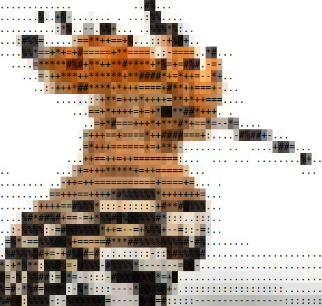

# hoopoe-player

> Play any video as colorful ASCII art directly in your terminal.


[](https://github.com/axol8002/hoopoe-player/issues)

## Installation

```bash
# Most systems
pip install hoopoe-player

# Ubuntu/Debian
pipx install hoopoe-player
```

You also need `ffmpeg` for audio:
```bash
sudo apt install ffmpeg   # Ubuntu/Debian
sudo pacman -S ffmpeg     # Arch
```

## Usage

```bash
# Play a YouTube video
hoopoe https://www.youtube.com/watch?v=xxxxx

# Play a local file
hoopoe -l video.mp4

# Enable audio
hoopoe -s https://www.youtube.com/watch?v=xxxxx

# Change character mode
hoopoe -m blocks https://www.youtube.com/watch?v=xxxxx

# Show status bar (time, volume, controls)
hoopoe --hud https://www.youtube.com/watch?v=xxxxx

# Loop video automatically
hoopoe --loop https://www.youtube.com/watch?v=xxxxx

# Sync video to audio clock (recommended with -s)
hoopoe -s --sync https://www.youtube.com/watch?v=xxxxx

# Stream webcam as ASCII art
hoopoe --webcam
hoopoe --webcam -m solid --hud
hoopoe --webcam --flip h --invert

# Highlight mode (color as background) with any character mode
hoopoe -m braille --highlight https://www.youtube.com/watch?v=xxxxx

# Combine options
hoopoe -l -s --sync -m classic --highlight --hud --loop video.mp4
```

## Features

- 🎬 **YouTube & local video** — stream any YouTube URL or play a local file directly
- 🎨 **6 character modes** — classic, blocks, braille, minimal, nocolor, solid
- 🌈 **True color** — full 24-bit RGB color per character for supported terminals
- 🔊 **Audio playback** (`-s`) — synced audio via ffmpeg/ffplay
- 📺 **Live stream support** — plays YouTube live streams with low-latency audio mode
- 🔗 **A/V sync mode** (`--sync`) — recommended with `-s`; drops frames to stay locked to the audio clock when rendering is slow, recovers automatically
- 🖥️ **HUD** (`--hud`) — status bar with timestamp, real-time FPS, mode and controls
- 🔁 **Loop mode** (`--loop`) — automatically restarts video and audio at the end
- 📸 **Screenshot** (`P`) — saves the current frame as a timestamped ANSI color file (`.ans`)
- 📐 **Dynamic resize** — terminal resize is applied immediately, even while paused
- 🖥️ **Alternate screen** — runs in a separate buffer like vim/htop; your terminal history is preserved on exit
- 📷 **Webcam support** (`--webcam`) — stream your webcam live as ASCII art; select camera index with `--camera`
- 🔀 **Flip** (`--flip h/v/hv`) — flip the webcam feed horizontally, vertically, or both
- 🌗 **Invert** (`--invert`) — invert brightness mapping for any character mode
- 🎨 **Highlight** (`--highlight`) — render color as background for any character mode

## Controls

| Key | Action |
|-----|--------|
| `Space` | Pause / Play |
| `P` | Screenshot — save current frame as `.ans` ANSI file |
| `Q` or `Ctrl+C` | Quit |

Controls are the same for video and webcam modes.

## Character modes

| Mode | Style |
|------|-------|
| `classic` | `. : - = + * # % @` — default, coloured |
| `blocks` | `░ ▒ ▓ █` — bold blocks, coloured |
| `braille` | `⠁ ⠃ ⠇ ⠿ ⣿` — dense dots, coloured |
| `minimal` | `· • ● ■` — clean and minimal, coloured |
| `nocolor` | classic chars, no colour — for legacy terminals |
| `solid` | pure color blocks — no characters, most accurate color reproduction |

Use `--highlight` with any mode to render color as background instead of foreground.
Use `--invert` with any mode to invert the brightness mapping.

## Viewing ANSI screenshots

Screenshots saved with `P` are `.ans` files containing raw ANSI escape codes. To view them:

```bash
cat hoopoe_screenshot_20260317_142301.ans
```

## Requirements

- Python 3.10+
- ffmpeg (optional, needed for `-s` audio)
- A terminal with true color support (for all modes except `nocolor`)

## Roadmap

### Features
- [x] **Webcam support** — stream your webcam live as ASCII art in the terminal (`--webcam`, `--camera`, `--flip`)
- [ ] **Image display** — render local images and online images as ASCII art in the terminal
- [ ] **GIF support** — render animated GIFs frame by frame
- [ ] **Broader URL support** — play videos from any URL, not just YouTube (Vimeo, Twitch, etc.)
- [ ] **`--fps` flag** — manually override the playback framerate
- [ ] **16-color mode** — fallback palette for terminals without true color support
- [ ] **`--output` to file** — save the full video render as an ANSI file instead of single screenshots

### Performance
- [x] **Numpy vectorisation** — reduced CPU usage per frame by replacing Python loops with matrix operations
- [x] **String join optimisation** — replaced `+=` string concatenation with list accumulation and `"".join()`
- [ ] **Dirty rendering** — only redraw lines that changed between frames; reduces terminal I/O for low-motion content

### Platform support
- [ ] **macOS** — minor adjustments needed (`ffmpeg` via Homebrew, no code changes expected)
- [ ] **Windows native** — replace `tty`/`termios` with `msvcrt` for key input, replace `SIGSTOP`/`SIGCONT` with Windows-compatible pause logic; WSL already works

## Star History

<a href="https://www.star-history.com/?repos=axol8002%2Fhoopoe-player&type=date&legend=top-left">
 <picture>
   <source media="(prefers-color-scheme: dark)" srcset="https://api.star-history.com/image?repos=axol8002/hoopoe-player&type=date&theme=dark&legend=top-left" />
   <source media="(prefers-color-scheme: light)" srcset="https://api.star-history.com/image?repos=axol8002/hoopoe-player&type=date&legend=top-left" />
   
 </picture>
</a>

## Support

<a href="https://buymeacoffee.com/axol8002">
  
</a>

## License

MIT
